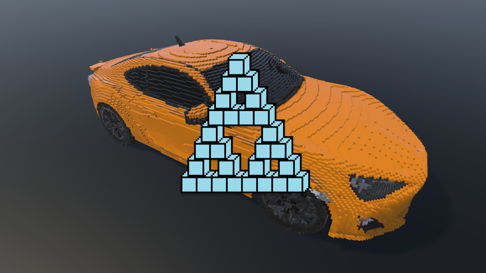

# Unity3D Mesh Voxelization Tool
Voxelize meshes of gameObject or prefab: as a copy of gameObject with voxel meshes/single voxel mesh/separate voxel GameObjects.

## Install
### Installing from a Git URL 
1. In the Unity3D editor go to: Window -> Package Manager.
2. Open the add menu in the Package Manager's toolbar.
3. The options for adding packages appear.
4. Select Add package from git URL from the add menu. Click on the Add button.

## Usage
via Editor Window
1. In the Unity3D editor go to: Window -> Mesh Voxelization Tool.
2. Select gameObject on the scene or prefab in the project files to voxelize.
3. Select mesh type: 
  * Static (for MeshFilter)
  * Animated (for SkinnedMeshRenderer)
  * All (for both types).
4. Set voxel size or subdivision level.
5. Select voxelization type: 
  * Voxelize (creates copy of gameObject with voxel meshes) 
  * Voxelize to single object (single voxel mesh)
  * Voxelize to primitives (separate voxel GameObjects)
6. Toggle preffered options.
7. You can change scale and mesh for individual voxel.
8. Select processing type: CPU single-thread / CPU multi-thread.
9. Click on Voxelize mesh.
10. Click on Save Mesh and select directory.
11. Now you can save created object on the scene as prefab ! :)

## Features
* Voxelize all meshes of gameObject or prefab and save result as prefab
* Support for UVs
* Support for Bone Weights
* Support for Multi-materials mesh
* Support for Submeshes
* Set custom mesh for individual voxel
* Save voxelized mesh as asset
* Save voxelized object as prefab
* Voxelization using CPU single-thread or multi-thread

## Missing Features/Future updates
* Backface culling
* Voxelization using GPU
* Runtime voxelization
* Optimization for voxelized model
* Fill model with voxels
* Export voxelized result to MagicaVoxel
* Bug fix
